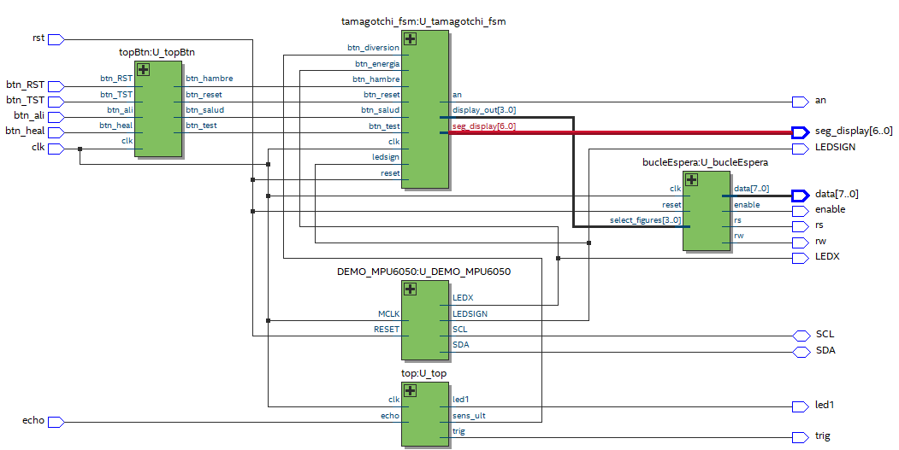

# Entrega 1 del proyecto WP01

* Juan José Delgado Estrada		
* Juan Jose Díaz Guerrero		
* Isabella Mendoza Cáceres
* Juan Angel Vargas Rodríguez

## Especificación de Diseño del Proyecto Tamagotchi en FPGA

Se desarrolla un sistema de Tamagotchi en FPGA (Field-Programmable Gate Array) que simule el cuidado de una mascota virtual. El diseño incorporará una lógica de estados para reflejar las diversas necesidades y condiciones de la mascota, junto con mecanismos de interacción a través de sensores y botones que permitan al usuario cuidar adecuadamente de la mascota.

Drive de Trabajo = https://docs.google.com/document/d/1uVYzq7XdJc5DKCoQSqGOa9-jXex2LjcXxlpm7lsy9yc/edit?usp=sharing 

**Primera Entrega (10% del total de la nota del proyecto)**

Objetivo: Definición periférica del proyecto y diseño inicial.

### Especificación detallada del sistema 
*Detalle de la especificación de los componentes del proyecto y su descripción funcional.*

| Componente  | Especificación | Funcionamiento|
| ------------- | ------------- | ------------- |
| Botón para Curar  | Pulsador con tapa (MCI00315)  | Cada vez que se oprima, aumenta el estado de Salud, cura al Tamogotchi. |
| Botón para Alimentar | Pulsador con tapa (MCI00315)  | Cada vez que se oprima, da de comer a la mascota, aumentando el nivel de alimentación. |
| Botón para Reset | Pulsador con tapa (MCI00315)  | Cuando esté presionado por 5 segundos, restablece el estado inicial del tamagotchi (todos los niveles al 100%).|
| Botón para Test| Pulsador con tapa (MCI00315)  | Cuando esté presionado por 5 segundos, permite hacer un sondeo rápido entren estados, dejando interactuar de manera directa para modificar el nivel en el que se encuentra el estado.|
| Sensor de Ultrasonido | Sensor HC-SR04 | Cuando detecte una proximidad de 1-5 cm, la mascota aumentará su estado de diversión.|
| Sensor de Movimiento | Sensor MPU 6050 | El giroscopio detecta si la mascota está boca abajo (nivel de energía aumenta porque está descansando) o boca arriba (está activo y va disminuyendo el nivel de energía).|
| Pantalla | LCD 16x2 | Se observan las 2 caras de la mascota (si se encuentra mal o bien). Además, muestra la necesidad a la que se está haciendo referencia mediante la visualización de un ícono.|
| Leds 7 segmentos | Ánodo común | Se muestra el porcentaje de todos los niveles.|
| FPGA | A-C4E6 Cyclone IV FPGA EP4CE6E22C8N | Controlador de las distintas operaciones que se desean hacer (contiene componentes lógicos programables).|

*Estados*
| Estado | Descripción | 
| ------------- | ------------- |
| Diversión | Cada vez que pasen 30 segundos, se baja el porcentaje de este estado si no se hace uso del sensor ultrasonido (caricia). |
| Salud | Cada vez que pasen 100 segundos, se baja el porcentaje de este estado. Solo se aumenta cuando se hace uso del botón de curar. |
| Alimentación | Cada vez que pasen 20 segundos, se baja el porcentaje de este estado. Para aumentarlo se debe presionar el botón de alimentación. |
| Energía | Cada vez que pasen 50 segundos, se baja el porcentaje de este estado. Cuando el giroscopio este invertido, es decir cuando el tamagotchi este boca abajo, aumenta este estado.|

*Sistema de Caja Negra General*

Al plantear el diseño incial del Tamagotchi, se tomaron como elementos iniciales el set de botones, al menos un sensor y el sistema de visualización. Para esto se definieron 4 botones con sus respectivas funciones: botón de reset, botón de test, botón para curar a la mascota y otro para alimentarla. Todos estos serán entradas para el sistema, tal como se muestra en el diagrama general de caja negra. Otras entradas del sistema son los sensores, los que se eligieron son el sensor de Ultrasonido  HC-SR04 y el giroscopio MPU6050. Tanto los botones como los sensores son entradas de un solo bit. En caso de los botones, si están activados o no, para el sensor de ultrasonido se pide que detecte si existe una proximidad a este entre 1-5cm por lo cual la señal que enviará es de si se presenta o no esta proximidad y para
el giroscopio se pide únicamente que detecte si este está orientado "cabeza arriba o abajo" por lo tanto también es una entrada de un bit. Y a las entradas se sumaría la señal clock.

Las visualizaciones tanto de los 7 segmentos como de la pantalla LCD 16x2 corresponden a las salidas. Las salidas que se observan: **datap_hp, datap_ali, datap_fun** y **datap_ener** son los porcentajes de cada estado que se mostrarán en los 7 segmentos, salud, alimentación, diversión y energía respectivamente. La salida **data_cara** corresponde a la imagen que se va a mostrar en la pantalla LCD.

*Tabla de SM visual*

Para la visualización se utiliza la siguiente convención:

Consiste en 5 bits de los cuales los primeras 3 cifras se toman en cuenta para determinar el estado que se muestra, ya sea la energia (000), la diversión (001), la alimentación (010) y la salud (011) además de un estado neutro (100) para no mostrar nada en la visualización. La dos cifras restantes determinan si el estado con el q se combina es alto o bajo demostrando una cara feliz (00) o triste (01) además de su respectiva cara neutra(10) con la misma finalidad del estado neutro.

*Diagrama de Flujo*

En el diagrama de flujo se encuentran diamantes para ejemplificar un condicional que se debe tener en cuenta para la sucesión de los siguientes pasos y se utilizan rectángulos para mostrar las acciones que se deben realizar durante ese paso. Además, al inicio del diagrama se encuentran los valores iniciales de los registros que se utilizarán dentro del mismo, los cuales siempre se encontrarán en un constante ciclo de cambios dada la funcionalidad del tamagotchi, a menos que se siga el camino donde el reset está presionado por más de 5 segundos.

Los principales pasos del diagrama de flujo son los condicionales que se encuentran en la parte superior, los cuales son la base de las próximas acciones que se realizarán sobre los registros dentro del código para poder hacer cambios en las visualizaciones del proyecto. Lo más importante en el camino que sigue el diagrama al cumplirse el condicional donde la señal muestre el botón como oprimido, es el ciclo de espera para volver a oprimir este y así cambiar los niveles de cada estado, además dependiendo de este valor puede existir un cambio en el icono que se muestra en la pantalla LCD si el nivel está por debajo o encima de cierto valor.

Por último, existen 2 etapas dentro del diagrama de flujo que rompen el funcionamiento general de un tamagotchi, el primero es el botón reset donde se vuelve a los valores iniciales como si se empezara a jugar desde cero, el otro el modo test donde el tamagotchi se encuentra en un estado de "desarrollador" ya que cambia entre estados y al oprimir el botón o interactuar con el sensor que interactúa con el estado para poner el mismo en sus valores máximos o mínimos dependiendo de en cuál de estos se encontraba anteriormente.

*FSM General*

La máquina de estados finitos (FSM) es un modelo de comportamiento con un número finito de estados por los que el tamagotchi podría estar. En este proyecto, se plantean inicialmente 42 posibles momentos en los que podría encontrarse el dispositivo, representados con círculos. Las transiciones entre los estados se dan por señales de estado; por ejemplo, el paso entre la energía y la alimentación se da al oprimir el botón de alimentar por primera vez, por lo que la señal de estado es la que muestra cuando este botón está oprimido. Finalmente, se encuentran los registros dentro de cada uno de los círculos; estos son las señales de control que se encargan de decidir qué tipo de acciones se realizarán en cada momento. Por ejemplo, el momento después de oprimir por segunda vez el botón de alimentar, se activan las señales que se encargan de sumar 1 nivel y restarle valores a su contador para que su valor sea 0.

Para generalizar, los principales momentos están dados por los estados que tendrá el tamagotchi y de estos desencadenan las acciones que se pueden realizar en cada una de ellas, además están los dos momentos de test y reset.

*Data Path/Sistema de Caja Gris*

El anterior diagrama es mucho más detallado que el sistema de caja negra. Este muestra cómo es que el tamagochi funciona internamente, reflejando en cierta parte una mayor complejidad y entendimiento de las operaciones internas y cómo se encuentran interconectadas, dando una idea más clara y amplia sobre cómo es que la máquina de estados finitos funciona como cerebro para todo el sistema (unidad de control). 

De esta representación queda visible la interacción y el control de los datos, mostrando claramente cómo se conectan los 2 sensores, los botones y la visualización del tamagochi mencionados anteriormente. Se nota las diferentes entradas y salidas de cada una de las cajas, observando la cantidad de memoria requerida para el traspaso de información en cada caso. Finalmente, de este diagrama se puede concluir que facilita la comprensión y el desarrollo del sistema de manera global.

**Segunda Entrega (20% del total de la nota del proyecto)**

### Desarrollo y simulación del diseño
*Ultrasonido*

*MPU6050 Giroscopio*
Para el desarrollo de la MPU6050, se utilizaron 3 módulos y un top. Estos códigos...

Primeramente, para poder analizar el código de la MPU6050 se utiliza un comparador análogo, pasando los datos a protocolo I2C. De esta forma, se puede analizar lo que recibe el sensor y lo que se envía del código.
Adicionalmente, se realiza una simulación del código para verificar los datos del compardaror, siendo la simulación la situación deseada y el comparador lo realmente recibido.

*FSM total*

A continuación, se muestra el RTL del Top

**Tercera Entrega (40% del total de la nota del proyecto)**

### Finalización e implementación del prototipo
