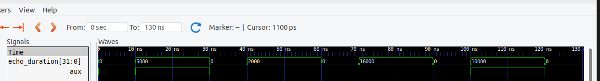
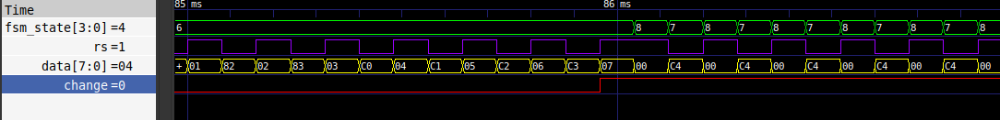

# Entrega 1 del proyecto WP01

- Juan José Delgado Estrada
- Juan Jose Díaz Guerrero
- Isabella Mendoza Cáceres
- Juan Angel Vargas Rodríguez

## Especificación de Diseño del Proyecto Tamagotchi en FPGA

Se desarrolla un sistema de Tamagotchi en FPGA (Field-Programmable Gate Array) que simule el cuidado de una mascota virtual. El diseño incorporará una lógica de estados para reflejar las diversas necesidades y condiciones de la mascota, junto con mecanismos de interacción a través de sensores y botones que permitan al usuario cuidar adecuadamente de la mascota.

Drive de Trabajo = https://docs.google.com/document/d/1uVYzq7XdJc5DKCoQSqGOa9-jXex2LjcXxlpm7lsy9yc/edit?usp=sharing

**Primera Entrega (10% del total de la nota del proyecto)**

Objetivo: Definición periférica del proyecto y diseño inicial.

### Especificación detallada del sistema

_Detalle de la especificación de los componentes del proyecto y su descripción funcional._

| Componente            | Especificación                      | Funcionamiento                                                                                                                                                                        |
| --------------------- | ----------------------------------- | ------------------------------------------------------------------------------------------------------------------------------------------------------------------------------------- |
| Botón para Curar      | Pulsador con tapa (MCI00315)        | Cada vez que se oprima, aumenta el estado de Salud, cura al Tamogotchi.                                                                                                               |
| Botón para Alimentar  | Pulsador con tapa (MCI00315)        | Cada vez que se oprima, da de comer a la mascota, aumentando el nivel de alimentación.                                                                                                |
| Botón para Reset      | Pulsadores FPGA    | Cuando esté presionado por 5 segundos, restablece el estado inicial del tamagotchi (todos los niveles al 100%).                                                                       |
| Botón para Test       | Pulsadores FPGA      | Cuando esté presionado por 5 segundos, permite hacer un sondeo rápido entren estados, dejando interactuar de manera directa para modificar el nivel en el que se encuentra el estado. |
| Sensor de Ultrasonido | Sensor HC-SR04                      | Cuando detecte una proximidad de 1-10 cm, la mascota aumentará su estado de diversión.                                                                                                 |
| Sensor de Movimiento  | Sensor MPU 6050                     | El giroscopio detecta si la mascota está durmiendo (nivel de energía aumenta porque está descansando) o boca arriba (está activo y va disminuyendo el nivel de energía).              |
| Pantalla              | LCD 16x2                            | Se observan las 2 caras de la mascota (si se encuentra mal o bien). Además, muestra la necesidad a la que se está haciendo referencia mediante la visualización de un ícono.          |
| Leds 7 segmentos      | Ánodo común                         | Se muestra el porcentaje del nivel seleccionado.                                                                                                                                      |
| FPGA                  | A-C4E6 Cyclone IV FPGA EP4CE6E22C8N | Controlador de las distintas operaciones que se desean hacer (contiene componentes lógicos programables).                                                                             |

_Estados_
| Estado | Descripción |
| ------------- | ------------- |
| Diversión | Es el estado que más rápido baja en porcentaje. Solo sube si se hace uso del sensor ultrasonido (caricia). |
| Salud | Es el estado que baja más lento en porcentaje. Solo se aumenta cuando se hace uso del botón de curar. |
| Alimentación | Es el segundo estado que más rápido baja en porcentaje después del estado de diversión. Para aumentarlo, se debe presionar el botón de alimentación. |
| Energía | Es el segundo estado que baja más lento en porcentaje después de el de salud. Cuando el giroscopio este invertido, es decir cuando el tamagotchi este boca abajo, aumenta este estado.|
| Muerte | Cuando los anteriores estados se encuentran todos en 1, se pasa al estado Muerte. No es posible salir a menos de que se oprima el botón de reset o el de test.|

_Sistema de Caja Negra General_


Al plantear el diseño incial del Tamagotchi, se tomaron como elementos iniciales el set de botones, al menos un sensor y el sistema de visualización. Para esto se definieron 4 botones con sus respectivas funciones: botón de reset, botón de test, botón para curar a la mascota y otro para alimentarla. Todos estos serán entradas para el sistema, tal como se muestra en el diagrama general de caja negra. Otras entradas del sistema son los sensores, los que se eligieron son el sensor de Ultrasonido HC-SR04 y el giroscopio MPU6050. Tanto los botones como los sensores son entradas de un solo bit. En caso de los botones, si están activados o no, para el sensor de ultrasonido se pide que detecte si existe una proximidad a este entre 1-5cm por lo cual la señal que enviará es de si se presenta o no esta proximidad y para
el giroscopio se pide únicamente que detecte si este está orientado "cabeza arriba o abajo" por lo tanto también es una entrada de un bit. Y a las entradas se sumaría la señal clock.

Las visualizaciones tanto de los 7 segmentos como de la pantalla LCD 16x2 corresponden a las salidas. Las salidas que se observan: **datap_hp, datap_ali, datap_fun** y **datap_ener** son los porcentajes de cada estado que se mostrarán en los 7 segmentos, salud, alimentación, diversión y energía respectivamente. La salida **data_cara** corresponde a la imagen que se va a mostrar en la pantalla LCD.

_Tabla de SM visual_

Para la visualización se utiliza la siguiente convención:

 

La visualización 1 consiste en 4 bits de los cuales las últimas 2 cifras se toman en cuenta para determinar el estado que se muestra, ya sea la energia (01), la diversión (11), la alimentación (10) y la salud (00). Las primeras dos cifras ssignificativas determinan si el estado con el q se combina es alto o bajo demostrando una cara feliz (01) o triste (00) además de su respectiva cara neutra(01) con la misma finalidad del estado neutro.

La vizualización 2 tiene prioridad por sobre la visualización 1. Consiste en dos bits en donde se determina si el tamagochi se encuentra durmiendo(01) o muerto (11), cuando el tamagochi no se encuentra en ninguno de estos estados envía un 00 para que funcione la visualización 1 con normalidad. 

_Diagrama de Flujo_


En el diagrama de flujo se encuentran diamantes para ejemplificar un condicional que se debe tener en cuenta para la sucesión de los siguientes pasos y se utilizan rectángulos para mostrar las acciones que se deben realizar durante ese paso. Además, al inicio del diagrama se encuentran los valores iniciales de los registros que se utilizarán dentro del mismo, los cuales siempre se encontrarán en un constante ciclo de cambios dada la funcionalidad del tamagotchi, a menos que se siga el camino donde el reset está presionado por más de 5 segundos.

Los principales pasos del diagrama de flujo son los condicionales que se encuentran en la parte superior, los cuales son la base de las próximas acciones que se realizarán sobre los registros dentro del código para poder hacer cambios en las visualizaciones del proyecto. Lo más importante en el camino que sigue el diagrama al cumplirse el condicional donde la señal muestre el botón como oprimido, es el ciclo de espera para volver a oprimir este y así cambiar los niveles de cada estado, además dependiendo de este valor puede existir un cambio en el icono que se muestra en la pantalla LCD si el nivel está por debajo o encima de cierto valor.

Por último, existen 2 etapas dentro del diagrama de flujo que rompen el funcionamiento general de un tamagotchi, el primero es el botón reset donde se vuelve a los valores iniciales como si se empezara a jugar desde cero, el otro el modo test donde el tamagotchi se encuentra en un estado de "desarrollador" ya que cambia entre estados y al oprimir el botón o interactuar con el sensor que interactúa con el estado para poner el mismo en sus valores máximos o mínimos dependiendo de en cuál de estos se encontraba anteriormente.

_FSM General_


La máquina de estados finitos (FSM) es un modelo de comportamiento con un número finito de estados por los que el tamagotchi podría estar. En este proyecto, se plantean inicialmente 42 posibles momentos en los que podría encontrarse el dispositivo, representados con círculos. Las transiciones entre los estados se dan por señales de estado; por ejemplo, el paso entre la energía y la alimentación se da al oprimir el botón de alimentar por primera vez, por lo que la señal de estado es la que muestra cuando este botón está oprimido. Finalmente, se encuentran los registros dentro de cada uno de los círculos; estos son las señales de control que se encargan de decidir qué tipo de acciones se realizarán en cada momento. Por ejemplo, el momento después de oprimir por segunda vez el botón de alimentar, se activan las señales que se encargan de sumar 1 nivel y restarle valores a su contador para que su valor sea 0.

Para generalizar, los principales momentos están dados por los estados que tendrá el tamagotchi y de estos desencadenan las acciones que se pueden realizar en cada una de ellas, además están los dos momentos de test y reset.

_Data Path/Sistema de Caja Gris_


El anterior diagrama es mucho más detallado que el sistema de caja negra. Este muestra cómo es que el tamagochi funciona internamente, reflejando en cierta parte una mayor complejidad y entendimiento de las operaciones internas y cómo se encuentran interconectadas, dando una idea más clara y amplia sobre cómo es que la máquina de estados finitos funciona como cerebro para todo el sistema (unidad de control).

De esta representación queda visible la interacción y el control de los datos, mostrando claramente cómo se conectan los 2 sensores, los botones y la visualización del tamagochi mencionados anteriormente. Se nota las diferentes entradas y salidas de cada una de las cajas, observando la cantidad de memoria requerida para el traspaso de información en cada caso. Finalmente, de este diagrama se puede concluir que facilita la comprensión y el desarrollo del sistema de manera global.

**Segunda Entrega (20% del total de la nota del proyecto)**

### Desarrollo y simulación del diseño

_Módulo de Botones_

El módulo top de los botones contiene 2 submódulos: uno para manejar los botones de manera sencilla y otro para implementar los botones de reset y test, los cuales deben estar presionados por 5 segundos para enviar una señal.

- Módulo btnAntirebote.v

El primer módulo [btnAntirebote.v](Tamagotchi/Botones/btn/btnAntirebote.v) implementa un módulo de botones antirebote, este inicialmente tiene 3 entradas: clk, boton*in y reset. La única salida que tiene el módulo es boton_out. Se tiene también un counter y un parámetro para indicar el valor final del contador: \_COUNT_BOT = 50000*. En cada ciclo de reloj se revisará el valor de reset, si este es 0 se le asignará al boton_out el valor de boton_in y counter será cero. Si reset es uno, se tienen que revisar varias opciones: primero si boton_in es igual a boton_out, en ese caso el counter aumentará, sino continuará en cero; la segunda condición es que boton_in sea 0 y el counter llegue al limite COUNT_BOT, en ese caso se le asignará 0 a boton_out y el counter se reincia; la tercera condición es que el boton_in sea 1 y el counter sea igual a la centesima parte del limite COUNT_BOT, en ese caso el counter vuelve a cero y a boton_out se le asigna uno. Para mayor simplicidad y para evitar una entrada a este módulo, se definio a reset como un registro con el valor de cero, dejando que la salida del módulo sea igual a la entrada.


- Módulo btnRT.v

El otro módulo [btnRT.v](Tamagotchi/Botones/btn/btnRT.v) tiene las entradas boton*in y clk, su salida será boton_out. Este tiene counter y un parametro local \_COUNT_LIMIT = 250 x 10⁶*. Lo que hace este módulo es esperar a que el boton este presionado 5 segundos para mandar la señal; el valor de COUNT_LIMIT viene de pasar esos 5 segundos a ciclos de reloj de la FPGA: 5 S = 5 \* 10⁹ nS, frecuencia del clk de la tarjeta = 50 MHz -> 20 nS por ciclo, teniendo en cuenta esto se obtiene que 5 segundos corresponden a 250 millones de ciclos de reloj.

Al probar un código inicial, se observó que al presionar un botón la FPGA toma esa señal como un 0, entonces si el boton_in = 0 quiere decir que esta presionado. La señal boton_out siempre será 1 a menos que el boton este presionado por más de 5 segundos, en ese momento se converitrá en cero. Esto se logra con el counter: si el boton_in esta presionado, el counter aumenta por cada ciclo de reloj y cuando llegue a COUNT_LIMIT el boton_out tomará el valor de 0, en cualquier otro caso será 1.

Para visualizar mejor la simulación se tomó un valor de COUNT_LIMIT menor, igual a 500 uS. Para el prototipo se tomo el valor original.


En ella se observa que boton_out solo bajará su valor si boton_in esta en bajo por 500uS y se mantendrá así hasta que boton_in vuelva a subir ó, como el counter tiene una cierta cantidad de bits, hasta que llegue counter llegue a su limite impuesto por la memoria.

- Módulo topBtn.v

El módulo top de los botones [topBtn.v](Tamagotchi/Botones/btn/topBtn.v) tiene como entrada los 4 botones del tamagotchi: btn_heal, btn_alimentación, btn_RST y btn_TST. Tendrán como salida 4 señales que irán a la FSM (btn_salud, btn_hambre, btn_reset, btn_test) y 4 leds para visualizar su funcionamiento en la FPGA (estos no serán implementados en el tamagotchi, solo se crearon para ver el correcto funcionamiento del módulo). Para las entradas btn_heal y btn_ali, se instanció el módulo [btnAntirebote.v](Tamagotchi/Botones/btn/btnAntirebote.v) y para btn_RST y btn_TST el módulo [btnRT.v](Tamagotchi/Botones/btn/btnRT.v), para las salidas de cada submódulo se implementaron cables wire (heal, ali, RST y TST).

En el módulo [btnAntirebote.v](Tamagotchi/Botones/btn/btnAntirebote.v) la salida es igual a la entrada y como la FPGA está negando los botones, las salidas btn_salud y btn_hambre se les asignará el valor negado de los wire (heal y ali respectivamente). Es decir que el boton siempre estaŕa en uno y cuando se presiona será cero, entonces a la salida del módulo se le asignará el valor contrario de la entrada para que envíe un uno cuando se presione el boton.

El módulo [btnRT.v](Tamagotchi/Botones/btn/btnRT.v) tiene como salida un cero cuando se tiene el boton presionado 5 segundos, entonces tambien se asignan los valores negados para las salidas btn_reset y btn_test. Los leds tendrán el mismo valor que los wire, entonces estarán prendidos siempre y cuando se presionen los botones se apagarán, o se apagrán depues de 5 segundos presionados para el caso de reset y test.


En la simulación, se observa que las entradas siempre son 1 y cuando bajan corresponden al boton presionado; las salidas siempre estarán en 0 y cambian a 1 cuando los botones se presionen. Para salud y hambre la salida cambia a 1 instantanemate y para reset y test después del tiempo determinado (para la simulación se muestra un tiempo de 500 uS pero para el prototipo real es un tiempo de 5 segundos).

_Ultrasonido_

Para instanciar el sensor ultrasónico se utilizaron 4 módulos y un Top. El sensor trabaja apartir de dos señales: trigger y echo, tal como se ve en la siguiente figura.


El sensor al recibir la señal trigger con una duración de 10 uS en estado alto, envía 8 pulsos de sonido de 40KHz y pone en alto la señal echo hasta que detecte que los pulsos de sonido vuelvan al sensor. Dependiendo de cuanto tiempo estuvo en alto la señal echo se puede determinar la distancia a la cual se encuentra el objeto con la siguiente fórmula: Distancia [cm] = Tiempo [uS] _ 0,01715. Esta se obtiene mediante la velocidad del sonido que es aproximadamente 29 cm/uS. Si se tiene el tiempo en el que la señal estuvo en alto, la distancia se encuentra dividiendo ese tiempo entre la velocidad; hay que tener en cuenta que la señal echo esta encendida desde que se envía al objeto hasta que vuelve, es decir solo se necesita la mitad del tiempo en la que esta encendida. Por esto la formula quedaría: Distancia [cm] = Tiempo [uS] / 2 _ 29 [cm/uS].

Teniendo claro esto, ahora se analiza los módulos, todos se encuentran en la carpeta [ultrasonido](ultrasonido) con todos sus detalles.

- ContadorConTrigger.v

El primer módulo es [ContadorConTrigger.v](Tamagotchi/ultrasonido/ContadorConTrigger.v). Este envía la señal Trigger al ultrasonido, la cual estará en alto por 10 uS y bajará, esto gracias a un counter que se registra en el código. La señal se enviará constantemente para que siempre se revise si hay un objeto frente al sensor. Se realizó un testbench para la simulación de este módulo: [ContadorConTrigger_tb.v](Tamagotchi/ultrasonido/ContadorConTrigger_tb.v):


En ella se puede ver que la señal trig esta en alto por 10 uS y reinicia su ciclo poniendose en bajo.

- ContadorConEcho.v

El segundno Módulo [ContadorConEcho.v](Tamagotchi/ultrasonido/ContadorConEcho.v) tendrá como entrada la señal Echo que recibe del sensor. Este tiene un contador que aumentará una unidad por cada ciclo de reloj en el que Echo esté en alto, en otro caso será 0. Tiene una salida llamada **echo_duration** a la que se le asignará el valor del counter cuando echo vuelva a cero. A continuación se muestra la simulación realizada.


En ella se puede observar que el counter es igual a cero cuando echo está en bajo y que la salida echo_counter solo tiene un valor diferente a cero justo después de que la señal echo baje que corresponde al último valor que tenía el counter.

- ControlLed.v

El tercer módulo llamado [ControlLed.v](Tamagotchi/ultrasonido/ControlLed.v) se encarga de verificar que el objeto que se detecta esta en el rango requerido entre 1 y 10 centímetros. Para esto hay que hallar la conversióń de centímetros a ciclos de reloj. Despejando de la ecuación que se mencionó anteriormente: distancia [cm] = tiempo [uS] \* 0,01715, se obtienen los tiempos 58 uS y 290 uS. Se sabe que la FPGA tiene una frecuancia de 50 MHz, es decir que toma 20 nS por cada ciclo de reloj, realizando la conversión se obtiene que tienen que pasar entre 2.900 y 14.500 ciclos de reloj con echo activo para que el objeto este en la distancia exigida. Este módulo recibirá la salida echo_duration del módulo anterior y en caso de que esta tenga un valor entre 2.900 y 14.500 se activará una señal llama **aux** la cual será la salida del módulo.



En la simulación hecha se puede apreciar que si echo_duration está entre los valores demandados, se activará la señal aux, en otro caso se mantendrá en 0.

- Salida.v

El siguiente módulo [Salida.v](Tamagotchi/ultrasonido/Salida.v) recibe la señal **aux**, la cual avisá si el sensor percibe un objeto. Sus salidas son las señales sens_ult, esta irá directamente a la FSM, y led, para verificar el funcionamiento adecuado del sensor. La señal sens_ult siempre estará en 0 hasta que la señal aux se ponga en alto, para que se pueda observar mejor la actuación del ultrasonido, esta señal estará en alto por 100 mS desde el flanco de subida de **aux**. La señal led tiene los valores contrarios a sens_ult, esto debido a que los leds de la FPGA están negados, entonces cuando estos reciban un 0 (sens_ult = 1) se encenderán.


Solo para observar mejor la simulación se disminuyo el tiempo en el que sens_ult está en alto a 100 uS. Así se mira que **sens_ult** se activa y **led** baja cuando **aux** tiene un flanco de subida, así se mantienen por el tiempo determinado. Se observa que si se recibe constantemente la señal aux, sens_ult se mantendrá en alto; gracias a esto si un objeto se queda quieto frente al sensor por mucho tiempo, el módulo sabrá que siempre esta ahí, si la señal fuera intermitente, el módulo creerá que el objeto se está removiendo y reubicando.

- top.v

El módulo [top.v](Tamagotchi/ultrasonido/top.v) simplemente realiza las conexiones entre los módulos. Sus entradas serán: clk (de la FPGA) y echo (del sensor). Sus salidas: trig (hacía el sensor), sens_ult (a la FSM) y led (a la FPGA). Y tiene cables internos: aux y echo_duration.


En la simulación del top se encuentra la señal trig enviandose constantemente, se simula la entrada echo, las señales sens_ult y led solo cambian si la señal echo está activa por el tiempo necesario, ni más ni menos. Por ejemplo la primera señal que se envía de echo es demasiado corta para activar las salidas, y la tercera es demasiado larga. Al final se ve que si recibe constantemente la misma señal de echo, las salidas se van a mantener en el mismo valor así echo este cambiando. En la simulación el tiempo en que las salidas están en alto es de 100uS, pero en la implementación el tiempo es de 100 mS; esto se hizo para poder observar mejor la simulación.

_MPU6050 Giroscopio_

Para el desarrollo de la MPU6050, se utilizaron 3 módulos y un top. El código [i2cmaster.v](Tamagotchi/mpu6050/i2cmaster.v) es el encargado de utilizar el protocolo I2C para la comunicación con el sensor MPU6050 por entradas bidireccionales de solo un bit. Adicionalmente, el código [mpu6050.v](Tamagotchi/mpu6050/mpu6050.v) se encarga de enviar la información de inicialización del sensor además de recoger la recibida del propio. Estos dos códigos en conjunto son los principales para poder llevar a cabo el registro de entrada y salida de datos de sensor. Además, se tiene el código [compare.v](Tamagotchi/mpu6050/compare.v), que lo que hace es justamente transformar este registro de la posición del giroscopio, en una salida de un bit (led) mostrando si está despierto o dormido según el signo del eje. Finalmente, se tiene el código [demompu6050.v](Tamagotchi/mpu6050/demo_mpu6050.v) que instancia los anteriores códigos para finalmente marcar 2 entradas (el clock de la FPGA y un reset), 2 entradas bidireccionales (SDA y SCL) y una salida que sería la del led.

Para iniciar, es necesario enviar un comando en específico, siendo este el _68_ que significa un reset para todo el sistema del sensor. Este envío del _68_ se establece en el código del **i2cmaster** como un parámetro de usual iterancia, ya que para cualquier tipo de inicio de envío de datos o de recepción de ellos se nesesita de él obligatoriamente como se muestra en el siguiente fragmento de código.

```verilog
...
S_START: begin
    STATUS <= 3'b001;
    SCL_OUT <= 1'b1;
    SDA_OUT <= 1'b0; //Genera el start bit (SDA pasa de alto a bajo mientras SCL está alto)
    NACK <= 1'b0;
    QUEUED <= 1'b0;
    STOP <= 1'b0;
    DATA_VALID <= 1'b0;
    if (TIC) begin
        SCL_OUT <= 1'b0; //Baja el reloj SCL para comenzar la transmisión
        counter <= 4'b0000;
        shift[7:1] <= DEVICE[6:0]; //Carga la dirección del dispositivo esclavo siendo parameter DEVICE = 8'h68
        if (WE) begin
            shift[0] <= 1'b0; //Para escritura, el último bit es '0' (RW bit)
            next_state <= S_WRITE;
        end else begin
            shift[0] <= 1'b1; //Para lectura, el último bit es '1' (RW bit)
            next_state <= S_READ;
        end
        state <= S_SENDBIT;
    end
end
...
```

Más adelante en este código se hace el proceso de recepción del ACK por parte del esclavo, para luego continuar con el envío o recepción de datos según dicte el código **mpu6050**

Principalmente, del codigo **mpu6050** tiene 6 estados mostrados a continuación:

```verilog
// Definición de los estados de la MPU6050
    parameter S_IDLE = 3'b000, //Estado inicial
              S_PWRMGT0 = 3'b001, //Estado de energía 0
              S_PWRMGT1 = 3'b010, //Estado de energía 1
              S_READ0 = 3'b011, //Estado para iniciar lectura
              S_READ1 = 3'b100, //Estado para continuar lectura
              S_STABLE = 3'b101; //Estado de estabilidad después de completar operación
```

El estado de energía 0 es el encargado de enviar el comando que se quiere registrar siendo este el PWR_MGMT_1, para luego (al pasar al siguiente estado de energía 1) se le de un valor inicial de 0, confirmando de esta manera el valor guardado en dicho registro que sería el del giroscopio.

Este envío de información desde el maestro al esclavo se puede observar en la simulación así como en las señales reales cuando se analizan en un comparador análogo con el protocolo I2C. De esta forma, se puede observar cómo es que responde el sensor (con un ACK o no) y qué es lo que realmente llega a recibir del código.
Por lo que, para verificar los dos momentos establecidos anteriormente, se decide poner la salida del comparador análogo a la par de la simulación como se muestra en la siguiente imagen, confirmando que los datos de envío y recepción de la comunicación son precisos y claros.


En la simulación se muestra solamente los datos enviados a la FPGA. Por medio del analizador lógico, se pudieron observar los datos de respuesta por parte del sensor y de esta manera identificar que son 14 datos de lectura(contando uno por parte del maestro). A continuación, se muestra que a partir del estado S_READ0 del [mpu6050.v](mpu6050/mpu6050.v), se comienza la lectura de datos que se almacena en el registro XREG instanciado en las últimas líneas de código del [demompu6050.v](mpu6050/demo_mpu6050.v). Este registro, como se observa en la simulación hecha, se activa apenas se llegua al estado de lectura y en este caso, puesto que en la simulación no se enviaron datos de parte del esclavo, se muestra como el envío de un bit (como alta impedancia). No obstante, para no simular entradas aleatorias y confirmando que los datos son válidos, se expone adicionalmente los datos recibidos por medio del analizador lógico.


_Pantalla LCD 16x2_

_ENTENDIMIENTO BÁSICO DEL CÓDIGO_

Para poder enterder correctamente el código de la LCD lo más importante es comprender el FSM que lo controla, como se explica en el código [BucleEspera.v](Tamagotchi/LCD/bucleEspera.v) Así como todo el código comentado.Aquí podemos ver el fragmento del FSM:


```verilog
always @(*) begin //FSM de la LCD
    case(fsm_state)
        IDLE: begin//Inicia los contadores y registros
		next <= (init_config_executed)? CREATE_CHARS : INIT_CONFIG; 
        end
        INIT_CONFIG: begin //Realiza la configuración inicial de la pantalla
		next <= (command_counter == num_commands)? CLEAR_COUNTERS0 : INIT_CONFIG; 
        end
        CLEAR_COUNTERS0: begin //Reinicia los contadores y registros
		next <= SELECT_VIEW;
        end
        SELECT_VIEW: begin//Se seleccionan las figuras necesarias dependiendo de select_figures y de sleep
            next <= CREATE_CHARS; 
        end
        CREATE_CHARS:begin//crea lso chars y los guarda en el CGRAM
            next <= (done_cgram_write)? CLEAR_COUNTERS1 : CREATE_CHARS;
        end
        CLEAR_COUNTERS1: begin//Reinicia los contadores y registros
            next <= SET_CURSOR_AND_WRITE;
        end
        SET_CURSOR_AND_WRITE: begin //Se indica la posición del cursor y lo que se escribe en ese espacio
            next <= (done_lcd_write)? WAIT: SET_CURSOR_AND_WRITE;
        end
        WAIT: begin //Espera hasta que el contador llegue al valor de WAIT_TIME
	    next <= (wait_done)? CLEAR_COUNTERS0 : SHOW_NOTHING;
	end
	SHOW_NOTHING: begin//Indica que el cursor se quede en una dirección en específico para no dañar la figura generada
	    next <= WAIT;
	end
        default: next = IDLE;//Estado Default
    endcase
end
```
Además de esto unas consideraciones importantes, la LCD 16x2 solo permite reescribir 8 direcciones CGRAM por lo que limita la visualización de carácteres especiales, por lo que el proceso de lectura y escritura de las figuras se realiza dos veces, una para la cara del gato y una para el estado, este cambio se ve controlado por el registro change que se usa en el código.

_SIMULACIONES_
- Simulación configuración condiciones iniciales

Se realiza la simulación, se ve como se inica correctamentr en el estado 0 del FSM para inicializar los registros que se usarán, Pasa al estado 1 del FSM en donde se mandan las configuraciones iniciales de la LCD, sabemos que es lectura de comandos al estar el rs en 0, y los comandos se mandan en data, loc aules corresponden con definir que se usará modo 8 bits de dos líneas y que son matrices de 5x8 píxeles por caracter (8’h38), se define que el cursor permanecerá apagado (8’h0C) y finaliza limpiando el display (8’h01), pasa al estado 2 del fsm en donde limpia todos los contadores necesarios. En el estado 3 se seleccionan de entre las visualizaciones las pertinentes dependiendo de las entradas que recibe el programa (Select_view y sleep).


  
- Simulación creación de chars

Al entrar en el estado 4 del FSM se indica la dirección y los datos de los carácteres especiales creados por nosotros guardados en txt en formato binario. En el data se muestra la dirección de la CGRAM en la que se guardan los datos, y después los binarios que van en ese espacio de la CGRAM, la LCD diferencia entre seleccionar el espacio y mandar los datos dependiendo de el valor del rs caundo es 0 selecciona la dirección cuando es 1 manda los datos de la imagen que se quiere guardar en el espacio previamente selccionado.


- Simulación de escritura de chars

Se pasa al estado 5 del FSM en donde se reinician los contadores, entra enel estado 6 del FSM en donde en primer momento se indica en que dirección de la pantalla se desea escribir el cáracter y lo escribe. Cuando el rs es 0 el data indica la dirección de la pantalla, y cuando rs es 1 indica el cáracter que se desea escribir (cáracter guardado previamente en el CGRAM).


- Simulación del bucle espera

Posteriormente entra a un bucle entre wait (Estado 7 del FSM) y show_nothing (estado 8 del FSM) por el tiempo determinado por un parámero inicial llamado WAIT_TIME, la función de estos dos estados es evitar que se reproduzcan carácteres no deseados en la pantalla además de controlar el tiempo en el que se muestran las figuras para mejorar su apreciación.
  


- Simulación cambio de lectura y escritura de figura

Cuando termina de mostrar la primer figura el registro change se vuelve 1 para poder realizar el mismo proceso de guardado en CGRAM y de escritura en la LCD de la segunda parte de la visualización. Recordemos que se deben mostrar dos figuras por cada visualización, una en donde muestre si el gato esta feliz o triste (dependiendo del nivel del estado que se desea ver), además de una imagen representativa del estado del que se está dando la información actualmente. Se debe realizar todo el proceso para cada figura debido a que la LCD 16x2 que se está manejando solo permite guardar 8 crácteres especiales, por lo que si se quiere una figura detallada aprovecharemos los 8 para una sola figura (Esto se relaciona con la capacidad de la memoria RAM de la LCD).
  


 Se aprecia el cambio del registro change apenas se acaba de mostrar la figura en la pantalla.


Se observa como se repite el proceso pero con change en 1 lo que hace que se procese la información de la segunda figura.

Cuando termina este proceso change vuelve a ser 0 para entrar en un bucle en el que se lea constantemente la figura que se desea mostrar y si hay algún cambio en esta determinado por Select_fig o sleep.


- Simulación cambio de entrada select_fig

Podemos ver como se detecta el cambio de select_fig y se muestra la figura seleccionada.
  


- Simulación cambio de entrada sleep

Ahora para mostrar el gato durmiendo o muerto se depende de la entrada sleep (esta variable tiene prioridad sobre select_fig). Podemos ver como se reconoce el cambio de la variable sleep y se realiza su proceso correspondiente para poder visualizarlo.
  


_FSM total_

- Simulación de botones en modo normal

En el módulo [FSM.v](Tamagotchi/ProyectoFinal/FSM.v) se realiza el control general de las acciones y estados del Tamagotchi, como se mostrará en las siguientes simulaciones. La primera acción a explicar será cómo debe comportarse la mascota digital al accionar los botones en un modo normal.


En esta imagen de simulación se observan las entradas btn_salud y btn_hambre. Estas señales, enviadas por el módulo previamente explicado [topBtn.v](Tamagotchi/ProyectoFinal/topBtn.v), son procesadas por este módulo para aumentar el valor de un punto en el estado. Como se muestra en las simulaciones, los valores de nivel_salud y nivel_hambre aumentan. Por otro lado, se evidencia el correcto funcionamiento del código, ya que, tras la primera pulsación del botón, solo cambia la señal display_out, la cual es enviada al módulo que controla la pantalla LCD. Además, se aprecia el buen comportamiento de las señales de salida en las visualizaciones. Al cambiar el nivel del estado mostrado, las señales varían de forma correspondiente.

- Simulación de sensores en modo normal

En la imagen siguiente se muestra la simulación del funcionamiento de los sensores en modo normal.


En la imagen anterior, se evidencia el correcto funcionamiento de los sensores. Al igual que los botones, los sensores muestran un aumento adecuado de los niveles de cada estado, lo que provoca el cambio en las señales de visualización. La principal diferencia con respecto a los botones es que la entrada de los sensores no se produce mediante una pulsación, sino que es una señal que aumenta de manera continua como resultado de la recepción de información. Para ello, se emplearon temporizadores individualizados para estos dos estados, de modo que las subidas de nivel estén temporizadas.

- Simulación de botones en modo test

A continuación, se muestra cómo responde el Tamagotchi a los botones en modo test.


En la imagen anterior, el cambio de pantalla entre estados es el mismo que en el modo normal. Tras la primera pulsación de los botones, cambia la señal de salida display_out, ajustándose a lo requerido en la especificación del proyecto. La diferencia en el modo test es que los niveles solo varían entre los valores 1 y 10, con el fin de mostrar los dos únicos estados en los que se puede encontrar cada una de las características del Tamagotchi. Durante estos cambios entre estos dos valores, se observa cómo el tercer bit menos significativo de la señal display_out es el único que varía.

- Simulacion de sensores en modo test

Como complemento del modo test, se muestra a continuación la simulación del funcionamiento de los sensores en este modo.


De manera similar a la simulación de los botones en modo test, los valores del nivel controlado por el usuario solo varían entre 1 y 10. La diferencia respecto al funcionamiento de los botones en modo test es la misma que en el modo normal: las señales generadas por los sensores requieren un contador para evitar que los cambios sean demasiado rápidos y difíciles de detectar.

- Simulacion de la disminucion de los niveles en modo normal

Finalmente, se presenta la simulación del descenso de los niveles de los estados con el paso del tiempo. A continuación, se muestra la imagen generada de esta simulación.


En la imagen anterior se observa el correcto funcionamiento de la disminución de los niveles con el paso del tiempo. Sin embargo, es importante aclarar que estas disminuciones no se reflejarán de la misma manera en la práctica. Para evitar tiempos de simulación demasiado extensos, se decidió reducir el valor de los temporizadores que controlan estos descensos, de modo que puedan apreciarse mejor en las simulaciones.

Nota final: Para una especificación más detallada del paso a paso del código, de la cantidad de señales y el funcionamiento de cada una de ellas, es recomendable revisar los comentarios incluidos en cada código.

### Diagrama RTL del Top


**Tercera Entrega (40% del total de la nota del proyecto)**

### Finalización e implementación del prototipo
_Video Implementación_

[](https://youtu.be/3_kACh5AmKY)

_Limitaciones y precauciones_

- Si se está interactuando en un estado, es recomendable no presionar algún incentivo para pasar a la vez a otro estado.

- Si los botones se presionan por más de el doble de ciclos del clock para la subida de un solo estado, se va a subir más de una vez el nivel.

- Si el tamagochi muere, solo es posible revivirlo cuando se presiona el botón RST o TST, ningún estado sube aunque se presionen los diferenetes incentivos.
